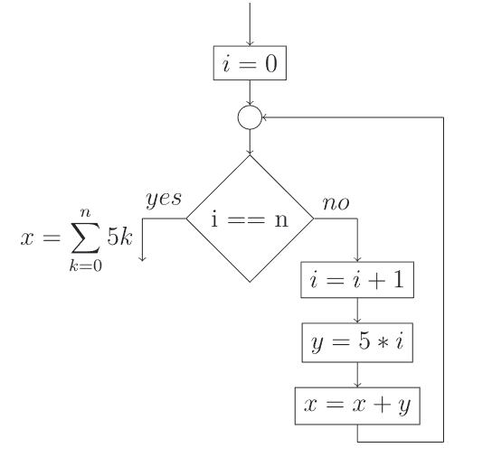
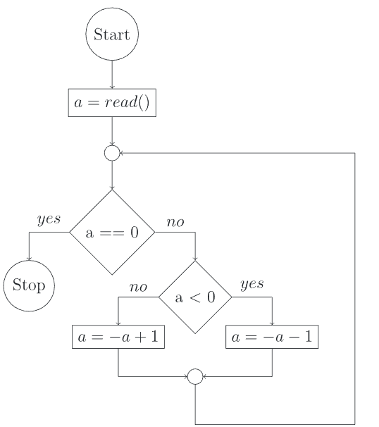
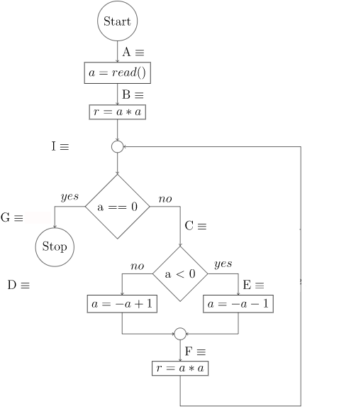

# Week4
In this week, we continue with the verification of the loop invariants, where 
we also show the termination of the program.

# Password for quiz today: 63590388 

# Y?
## Show that this program is locally consistent.
 <br>

## We first fill the state table, to figure out the relationship 

| variables | 0 | 1 | 2 | 4 | 5 | ... | n |
| - | - | - | - | - | - | - | - |
| x | 0 | 5| >!15!< | >!30!< | >!50!< | ... | $x=\sum_{k=0}^n5k$ |
| y | 0 | 5 | >!10!< | >!15!< | >!20!< | ... | >!5n!< |
| i | 0 | 1 | >!2!< | >!3!< | >!4!< | ... | n |
We can then summarize the relationship between x and i.
$$x=\sum_{k=0}^i5k$$
And thus the loop invariant
$$I :\equiv x=\sum_{k=0}^i5k \land i\geq0$$

## Now, try to show the local consistency with this loop invariant.
Consider the following questions
  - Why don't we need to include **y** in the loop invariant? <br>
    >! The assertion at the end of the program does not include **y**, hence it is not necessary to include y to show the 
    local consistency !<
  - Why don't we need to state the **upperbound** of **i** in the loop invariant? <br>
    >! The loop invariant with the **upperbound** is also correct, it is just the case that we do not need it here. !<

| WP | WP after simplification |
| - | - |
| $\textbf{WP}[x = x + y;](I)$ | $A :\equiv x= -y + \sum_{k=0}^i5k \land i\geq0$ |
| $\textbf{WP}[y = 5 * i;](A)$ | $B :\equiv x= -5i + \sum_{k=0}^i5k \land i\geq0 $|
| $\textbf{WP}[i = i + 1;](B)$ | $C :\equiv x = \sum_{k=0}^i5k \land i + 1\geq0$ |
| $\textbf{WP}[i == n](Z, C)$ | $J :\equiv (i \not= n \land x = \sum_{k=0}^i5k \land i + 1\geq0) \lor (i = n \land x = \sum_{k=0}^n5k)$| 

Since 
$$I \equiv x=\sum_{k=0}^i5k \land i\geq0 \Longrightarrow (i \not= n \land x = \sum_{k=0}^i5k \land i + 1\geq0) \lor (i = n \land x = \sum_{k=0}^n5k) \equiv J$$
We say this loop invariant is locally consistent.

# Termination 
 - Does a loop-free program terminate? <br>
   >! Yes !<
 - Does a loop-contained program terminate? <br>
   >! It depends. !<
 - Consider the following programs. For which inputs do they terminate?
 ```c
 // Program 0
 int i = read();
 while (i > 0) {
  i--;
 }
 ```
 ```c
 // Program 1
 int x = read();
 int i = read();
 while (x * i < 0) {
  x = x + 1;
  i = i + 1;
 }
 ```
 ```c
 // Program 2
 int x = read();
 int i = read();
 while (x * i < 0) {
  x = x + 1;
  i = i - 1;
 }
 // Hint: Let's assume that there is no overflow in this program.
 ```
 - Do you find any metrics that decides the termination of the program? <br>
  >! If the number of iteration is finite, the program terminates! Thus, we can find a variable that counts the iteration! !<
 - It is metrics easy to find? Do you think of any alternatives? <br>
  >!It is not explicitly given, so we may find another metrics that is **monoton decreasing** after each iteration. 
  When it reaches a bound, the program terminates.!< <br>
  Do you find this new metrics in program 2? <br>
  >! max(0-x, 0-i) = max(-x, -i). When this metrics is less equal 0, the program terminates. !<

## To summarize
We can always find a monoton decreasing metrics in a terminating program. The program terminates if and only if this metrics reaches a **bound**, e.g. 0.  
 - How do we modify the program using this approach?
   1. >! Initialize the metrics before we enter the loop!<
   2. >! Update the state of the metrics, when we get out of the loop. !<
 - What do we show after the modification of the program?
   >! Same old thing: **Local consistency**!!! !<

See program 1 modified using this approach
```c
 // Program 1 modified
 // assume we have a maximum function

 int x = read();
 int i = read();
 int r = max(-x, -i);

 while (r <= 0) {
  x = x + 1;
  i = i + 1;
  r = max(-x, -i);
 }
```

# A Wavy approach
Now it's time to practice on this approach. Prove the termination of this program. <br>


## State table
Again, we start with a table which documents the value of **a**

| variables | 0 | 1 | 2 | 4 | 5 | ... | end |
| - | - | - | - | - | - | - | - |
| a = 10 | -9 | 8 | -7 | 6 | -5 | ... | 0 |
| a = -10 | 9 | -8 | 7 | -6 | 5 | ... | 0 |
| a = 42 | -41 | 40 | -39 | 38 | -37 | ... | 0 |

 - What is the metrics that is **monoton decreasing** in this program? <br>
  >! a square or the norm of a !<
 - What does the program look like after the termination? <br>
   
